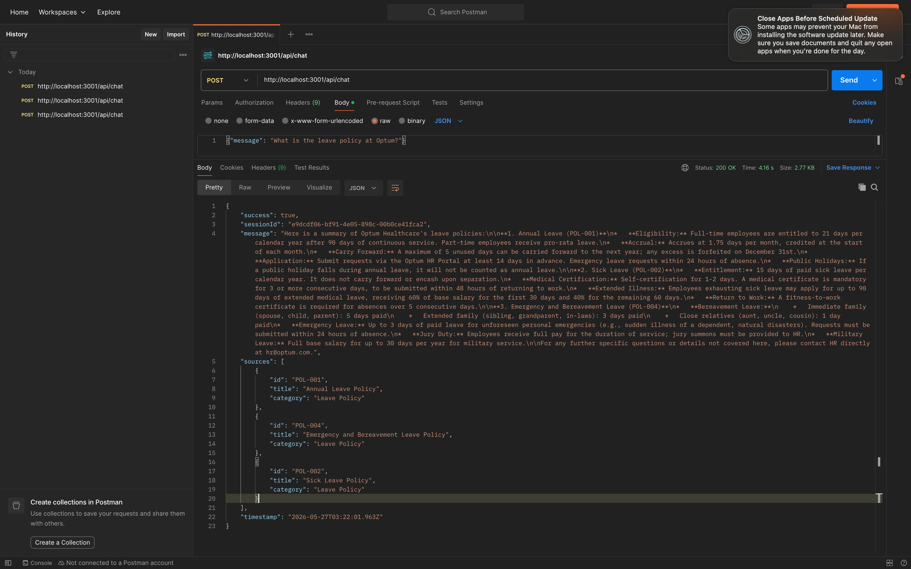
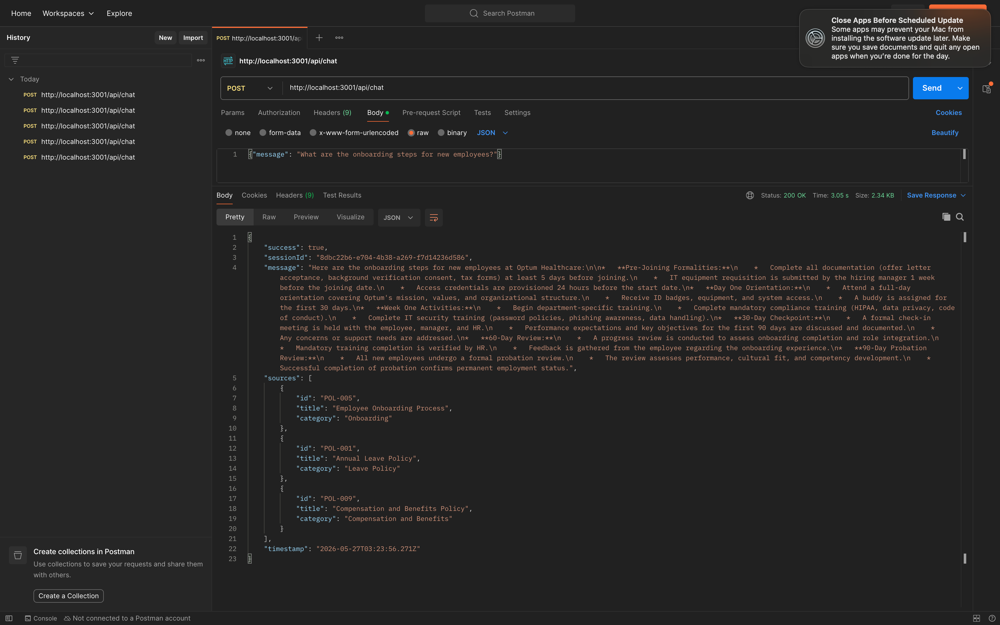
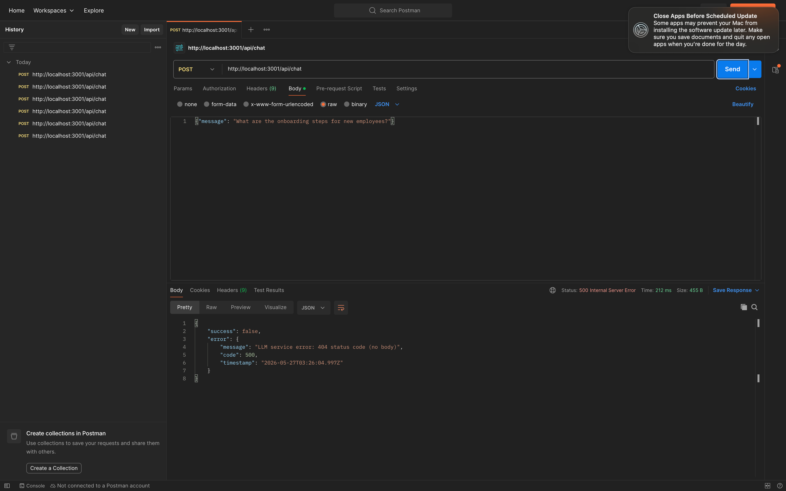
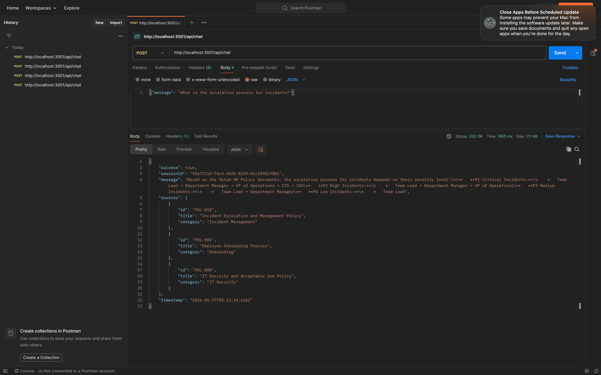

# Architecture Overview
## Optum Enterprise HR Knowledge Copilot

---

## 1. High-Level Architecture
FrontEnd(React + Typescript) localhost:3000
                  ||
                  ||
            HTTP REST(JSON)
                  ||
            POST/api/chat
Backend(NodeJS + Express JS) localhost: 3001
                  ||
           Middleware Layer(requestlogger|errorHandler)
                  ||
           Chat Controller ---> RAG Service
                  ||
           Vector Store(In -memory keyword RAG)--> Gemini Services(LLM Calls)
                  ||
           Data Loader hr_polices.json
                  ||
           Google Gemini API
---

## 2. Technology Stack

### Frontend
| Technology | Version | Purpose |
|---|---|---|
| React | 18.x | UI Framework |
| TypeScript | 4.x | Type Safety |
| Tailwind CSS | 3.x | Styling |
| Axios | 1.x | HTTP Client |
| UUID | 9.x | Session Management |

### Backend
| Technology | Version | Purpose |
|---|---|---|
| Node.js | 20.x | Runtime |
| Express | 4.x | Web Framework |
| OpenAI SDK | Latest | Gemini API Client |
| dotenv | Latest | Environment Config |
| uuid | Latest | Session IDs |

### AI & Data
| Technology | Purpose |
|---|---|
| Google Gemini 1.5 Flash | LLM for response generation |
| In-Memory Vector Store | Policy document retrieval |
| HR Policies JSON | 12 Optum HR policy documents |
| RAG Pipeline | Grounded response generation |

## Contract Screenshot

## 4. Data Flow
Employee types question in React UI
Frontend sends POST /api/chat with message + sessionId
Backend receives request → requestLogger middleware logs it
ChatController extracts message and session history
RAG Service searches Vector Store for top 3 relevant policies
RAG Service builds prompt with context + question
Gemini Service calls Google Gemini API
Gemini returns response
Backend returns response + source policy references
Frontend displays response with SourceBadge + FeedbackButtons
Employee clicks 👍/👎 → POST /api/chat/feedback

---

## 5. Scale-Out Considerations

| Current (POC) | Production Scale |
|---|---|
| In-memory vector store | Pinecone / Weaviate / pgvector |
| JSON file knowledge base | PostgreSQL / MongoDB |
| Single Node.js process | Kubernetes + horizontal scaling |
| No authentication | Optum SSO / OAuth 2.0 |
| Console logging | ELK Stack / Datadog |
| No caching | Redis for frequent queries |
| Free Gemini tier | Gemini paid tier / Azure OpenAI |
| Local development | AWS / Azure cloud deployment |

---

